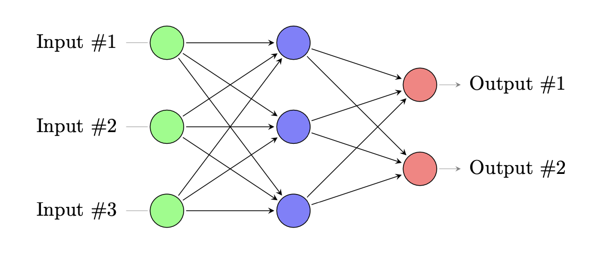

**We aim to investigate the relationship between the weights of a neural network and the complexity of the functions it learns. To do this, we will train a neural network using binary functions as inputs. Each binary function will be labeled with a unique identifier, μ. We will record the weight matrices corresponding to each function and analyze the relationship between these weights and the input functions.**

Consider a neural network with the following structure:

the number of neurons in each layer is given by:

-   **Input layer**: n neurons
-   **Hidden layer**: h neurons
-   **Output layer**: m neurons

The input (X) is a binary vector:

$$
X = (-1,+1)^n
$$

The output (Y) is also a binary vector:

$$
Y \in (-1,+1)^m
$$

#### Choosing Activation Function:

Initially, we considered using the sine function:

$$
\sin\left( \sum_{i}  z_{ij} w_{ij} + b_j \right) = y_i
$$

However, the periodic nature of the sine function can introduce unintended oscillatory behavior in the network’s outputs, making it unsuitable, especially when dealing with binary vectors where clear, non-repeating activation patterns are needed.

Another candidate was tanh, but that wasn’t suitable either. Despite our network layers not being deep, tanh can still suffer from gradient saturation for large positive or negative inputs, where the gradient becomes very small. This can hinder the learning process and make it difficult for the network to effectively adjust its weights:

$$
\tanh(x) = \frac{e^x - e^{-x}}{e^x + e^{-x}}
$$

Moreover, tanh outputs can still oscillate around the boundary values (-1 and 1), which might not be ideal for binary vectors as it can lead to less distinct separation of binary states.

We also considered using the ReLU (Rectified Linear Unit) function, defined as:

$$
\text{ReLU}\left( \sum_{i}  z_{ij} w_{ij} + b_j \right) = \max\left(0, \sum_{i}  z_{ij} w_{ij} + b_j \right)
$$

While ReLU is popular due to its simplicity and effectiveness in deep networks, it is not suitable for our problem because it outputs non-negative values, which does not align well with our binary output requirements of $-1$ and $+1$. Additionally, ReLU can lead to dead neurons, where neurons stop learning altogether if they get stuck in the negative side of the input space.

Instead, we should consider using the sigmoid function, defined as:

$$
\sigma\left( \sum_{i}  z_{ij} w_{ij} + b_j \right) = \frac{1}{1 + e^{-\sum_{i} z_{ij} w_{ij} + b_j}}
$$

The sigmoid function is effective because it outputs values in the range $(0, 1)$, which can be easily transformed to match our binary output requirements of $-1$ and $+1$. It introduces non-linearity into the model, enabling the network to learn complex patterns. Moreover, the sigmoid function has a smooth gradient, which helps in the effective adjustment of weights during the learning process without causing the issues of gradient saturation as severely as tanh.

The input can be represented as binary vectors of length $(n)$, where each element can be $+1$ or $-1$. The total number of possible inputs is $(2^n)$.

$$
{2^n} =
\begin{cases}
    x_1 & \begin{cases}
        +1 \\
        -1
    \end{cases} \\
    x_2 \\
    . \\
    x_n
\end{cases}
$$

The number of possible input-output function pairs is:

$$
(2^m)^{2^n} = 2 \times 2 \times \dots
$$

For instance:

$$
\begin{cases}
    m = 1 \\
    n = 3 \\
\end{cases}
: (2)^{2^3} => 2^ 8
$$

Each input vector $\vec{x}$ will be labeled with an identifier μ, ranging from 1 to $2^8$. For each μ, we will record the corresponding weight matrices:

$$
\mu(\vec{x}) = y
$$

$$
\mu = 1, \dots, 2^8
$$

$$
\text{wights} = \vec{w_1} , \vec{w_2} \dots
$$

Here are some example functions that the neural network will learn:
The group that all are either $+1$ or all are $-1$:

$$
f_1 =
\begin{cases}
    \vec{x_1} \rightarrow + \\
    \vec{x_2} \rightarrow + \\
	\dots \\
    \vec{x_{2^n}} \rightarrow + \\
\end{cases}
$$

The Group that has one -1:

$$
f_2 =
\begin{cases}
    \vec{x_1} \rightarrow - \\
    \vec{x_2} \rightarrow + \\
	\dots \\
    \vec{x_{2^n}} \rightarrow + \\
\end{cases}
$$

The group that has more thatn that:

$$
f_3 =
\begin{cases}
    \vec{x_1} \rightarrow - \\
    \vec{x_2} \rightarrow + \\
	\dots \\
    \vec{x_{2^n}} \rightarrow - \\
\end{cases}
$$

some other points that are important:

Consider an input

$$
\mathcal{X} = (+, +, +)
$$

It has three immediate neighbors:

$$
\text{neighbours:}
\begin{cases}
	\mathcal{X} = (-, +, +) \\
	\mathcal{X} = (+, -, +) \\
	\mathcal{X} = (+, +, -) \\
\end{cases}
$$

we can use that as quantity for complexity of the function. if all of the neighbours are higher than our input we know we have the lowest point. which is the important goal in gradient decent.

In programming, we can represent binary inputs as integers for simplicity. For example:

$$
\begin{cases}
0,0,0 \rightarrow 0 \\
0,0,1 \rightarrow 1 \\
0,1,0 \rightarrow 2 \\
0,1,1 \rightarrow 3 \\
1,0,0 \rightarrow 4 \\
\end{cases}
$$

Another approach to assessing the complexity of the functions is by examining the number of backpropagation iterations required for the neural network to learn each function. The idea is that a more complex function will require a greater number of iterations for the network to adjust its weights and achieve an acceptable level of accuracy. Therefore, the number of backpropagation iterations can serve as a practical measure of the function’s complexity. Learning_Binary_functions
